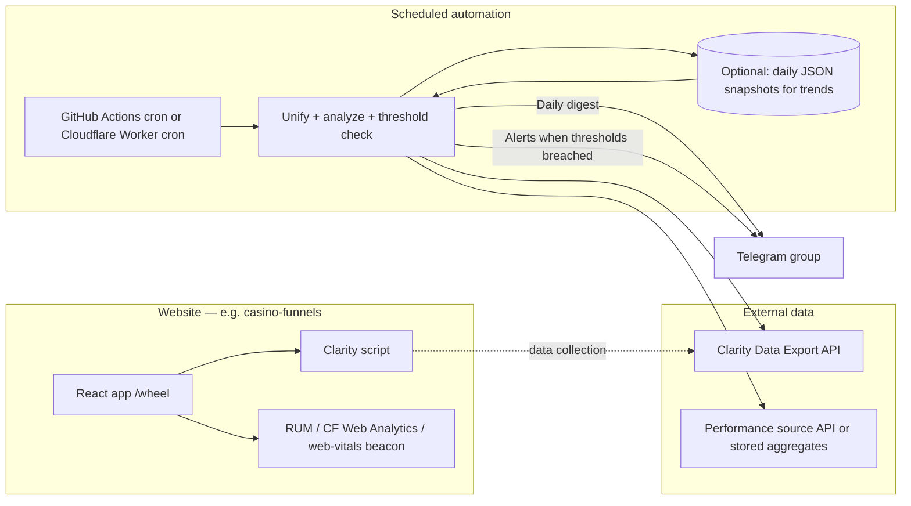

# Unified Performance Monitoring, Clarity Analysis & Telegram Alerts

Structured plan for real-user insights, Microsoft Clarity programmatic analysis, a **single daily performance digest** in English (or your chosen language in the template), and **alert messages** to a **Telegram group**.

---

## 1. Objectives

| Goal | How it is satisfied |
|------|---------------------|
| Understand real user friction | Microsoft Clarity (sessions, heatmaps in UI; metrics via Data Export API) |
| Measure real-world performance | Field data: **Web Vitals** (RUM), **Cloudflare Web Analytics**, and/or **Chrome UX Report (CrUX)** — Clarity Export API does **not** replace Core Web Vitals |
| One consolidated report | One scheduled job builds one message (and optional link to a longer artifact) |
| Proactive alerts | Same or higher-frequency job compares metrics to thresholds and sends a separate **ALERT** message to the group |

---

## 2. High-Level Architecture

**Principles**

- Clarity runs **in the browser** on your site.
- The **Data Export API** is used **only by the automation** to pull aggregate metrics (no PII in typical export shapes — still treat tokens as secrets).
- Performance field data comes from a **second pipeline** so the “unified report” has two labeled sections: **Behavior (Clarity)** and **Performance (field)**.

### 2.1 Why GitHub Actions as the scheduler (casino-funnels)

For this stack, **GitHub Actions `schedule`** is a strong default:

- **No server to maintain** — cron is hosted; secrets are first-class.
- **Snapshots for trends** — persist daily JSON as **workflow artifacts** (retention-limited but simple) or push to a **private branch** / private repo (“git as a lightweight trend database”) so 7-day baselines and relative alerts do not depend on Clarity’s short lookback.
- **Same repo as the funnel** — keeps the reporting script versioned next to the product.

Optional: a **Cloudflare Worker cron** if you later want everything off GitHub or need edge-adjacent logic.

---

## 3. Microsoft Clarity — Programmatic Analysis

### 3.1 API

- **Endpoint:** `GET https://www.clarity.ms/export-data/api/v1/project-live-insights`
- **Auth:** `Authorization: Bearer <token>`
- **Token:** Project admin → **Settings → Data Export → Generate new API token**

### 3.2 Query parameters

- `numOfDays`: `1`, `2`, or `3` (last 24 / 48 / 72 hours from call time, UTC).
- Optional breakdowns: `dimension1`, `dimension2`, `dimension3` from: Browser, Device, Country/Region, OS, Source, Medium, Campaign, Channel, **URL**, etc.

### 3.3 Metrics (from Microsoft documentation — examples)

Includes, among others: Traffic, Engagement Time, Scroll Depth, Dead Click Count, Rage Click Count, Script Error Count, Error Click Count, Quickback Click, Excessive Scroll, plus dimensional breakdowns.

### 3.4 Limits (critical for design)

| Limit | Implication |
|--------|-------------|
| **10 requests per project per day** | Budget calls: prefer **one wide pull** per run when possible (see 3.5) |
| **Only last 1–3 days** | No native “last 30 days” from this API alone |
| **Up to 1,000 rows, no pagination** | Prefer focused dimensions (e.g. URL) and aggregate in your job if needed |

**Trend analysis:** Store a **daily snapshot** (JSON) in private storage (e.g. R2, KV, **GitHub Actions artifacts**, **private branch**, or encrypted blob) so week-over-week comparisons do not depend on Clarity holding long history in the Export API.

### 3.5 Quota strategy: one call, many dimensions

With **10 requests per day per project**, design the daily job to use **as few GETs as possible** — often **one primary request** that sets `dimension1`, `dimension2`, and `dimension3` to the breakdowns you actually need (e.g. **OS**, **Device**, **Country/Region**, or **URL** as one of the three) so you do not burn quota on redundant slices.

Reserve extra calls for ad-hoc investigations or a second dimension set on heavy days, not for routine digest + alert.

### 3.6 “Magic metric” for the digest: rage clicks per session

In the **daily digest**, emphasize the **ratio**:

**Rage Click Count ÷ Total Sessions** (or rage clicks per 1k sessions), computed consistently from the same export window.

A **spike in this rate** (not only raw rage count) is often the **fastest signal** that a **deploy or UI change** broke expectations — especially on days with high traffic from a campaign, where absolute counts alone look “fine.”

Pair with **Script Error Count** trends in the digest; see **§10** for how this relates to heavier error tooling.

---

## 4. Performance (Field Data) Layer

Clarity answers **“what users did / where they struggled.”**  
Core Web Vitals answer **“how fast and smooth it felt.”**

### 4.1 Recommended pair for this stack (React / Vite / Cloudflare Pages)

**Use both:**

1. **Cloudflare Web Analytics** — lightweight, privacy-oriented, **minimal impact on bundle size** (no heavy client RUM library required for a first phase). Good for **real-time-ish** traffic and trends inside the Cloudflare surface.
2. **Chrome UX Report (CrUX) API** — field metrics aligned with **what Google’s systems see** (relevant for **SEO** and **ads quality** narratives). Complements CF with an independent **Chrome-user** population.

Together they reduce blind spots: CF for **your** edge and traffic; CrUX for **ecosystem-grounded** Core Web Vitals when URL/origin has enough eligible traffic.

### 4.2 Other options

3. **Custom RUM:** `web-vitals` → beacon to a **Worker** or small API → store aggregates (p75/p95 by route, device class). Use when you need **per-build** or **per-experiment** granularity beyond CrUX cadence.
4. If CrUX has insufficient volume for URL-level data, rely on **origin-level** CrUX + CF + optional custom RUM.

**Minimum for `/wheel`:** report **LCP**, **INP** (or legacy responsiveness proxy if needed), **CLS** at **p75** (or CrUX histogram percentiles where reported).

---

## 5. Unified Daily Report (Telegram)

### 5.1 Delivery

- **Target:** Telegram **group** (negative `chat_id`); bot must be allowed to post.
- **Schedule:** e.g. once per day at a fixed time (UTC or local — be consistent).

### 5.2 Suggested report structure (English template)

1. **Header:** Site name, date range, environment (production).
2. **Clarity — Behavior (last 24–72h):**  
   - Traffic / session-related totals if useful  
   - **Magic metric:** **Rage Click rate** = rage clicks per session (or per 1k sessions); flag vs prior snapshot / rolling baseline  
   - **Script Error Count** — highlight if up vs prior snapshot  
   - **Dead Click** — top URLs or worst segment (Device/OS/Country)  
   - Short bullet: “No unusual friction” vs “Investigate URL X”
3. **Performance — Field:**  
   - p75 LCP / INP / CLS for `/wheel` (or origin-level if URL-level unavailable)  
   - Compare to prior day or rolling baseline if snapshots exist
4. **Footer:** Link to Clarity dashboard + (optional) link to longer doc or chart image.

**Length:** Telegram messages are comfortable under ~4k characters; split into two messages or attach a link if longer.

### 5.3 Optional LLM summary

A second step may pass **only aggregated numbers** (no raw session data) to an LLM to generate one paragraph of interpretation. This is **optional** and must not replace threshold-based alerts.

### 5.4 Keeping Telegram an actionable tool (not noise)

- **Digest** stays structured and short; **alerts** fire only on **meaningful change** (see §6.1 relative logic).
- Prefer **one daily digest** plus **sparse alerts** over many messages per day.

---

## 6. Alerts (Separate from the Daily Digest)

**Digest** = routine status.  
**Alert** = immediate signal when something is wrong.

### 6.1 Alert logic: prefer relative change over fixed counts

Fixed thresholds (e.g. “more than 10 errors”) often **false-positive** on high-traffic days (e.g. after a successful campaign).

**Preferred pattern:** compare today (or last 24h) to a **rolling baseline**:

- Example: **Alert if rage click *rate* (per session or per 1k sessions) is > 50% higher than the 7-day average.**  
- Same idea for **Script Error Count** normalized by sessions or page views, when the export allows consistent denominators.

Keep **absolute guardrails** for catastrophic cases (e.g. script errors jump from near-zero to a large number in one day).

| Source | Example condition |
|--------|-------------------|
| Clarity export | Rage rate or script-error rate **> X% above 7-day mean**; optional absolute floor to suppress noise on tiny traffic |
| Field performance | CrUX / stored p75 **worse than baseline** by Y% or crosses a hard SLA (e.g. “good” threshold) |
| Synthetic (optional) | Homepage non-200 or TTFB > Z ms from a probe region |

### 6.2 Telegram message format: scannable, copy-paste friendly

Use **`parse_mode: HTML`** (or `MarkdownV2` if you prefer escaping discipline) so messages are **easy to scan**:

- **Bold** (`<b>...</b>`) for **outlier metrics** and alert titles.
- **Monospace** (`<code>...</code>`) for **problem URLs** and paths — one tap to copy into the browser or IDE.
- **Hyperlinks** (`<a href="...">Open Clarity</a>`) to the **Clarity project dashboard**; where Clarity supports **URL parameters** for date range, segment, or page filter, embed those so the link opens **close to the incident** (verify current parameter syntax in Clarity docs or by copying URLs from an already-filtered view — query strings evolve).

This turns the bot into a **working tool**: read → click → reproduce.

### 6.3 Frequency

- Digest: daily.  
- Alerts: same job with stricter checks, or a **more frequent** cron (e.g. every 6 hours) using only cheap checks (stored aggregates + last Clarity pull).

---

## 7. Secrets & Security

Store in **GitHub Actions secrets** or **Cloudflare Worker secrets** (never in git):

- `CLARITY_DATA_EXPORT_TOKEN`
- `TELEGRAM_BOT_TOKEN`
- `TELEGRAM_CHAT_ID` (group id is typically negative)

Rotate Clarity token if team access changes. Restrict which workflows can use secrets.

---

## 8. Telegram Setup (Checklist)

1. Create a bot with **@BotFather** → save **bot token**.
2. Add the bot to the **group**; send a message; resolve **chat id** via `getUpdates` or a small script.
3. Test: `sendMessage` with **`parse_mode: HTML`** for bold + `<code>` URLs + `<a href>` links (see §6.2).
4. Ensure the bot is not restricted from posting (group permissions).

**API:** `POST https://api.telegram.org/bot<TOKEN>/sendMessage`  
Body: `{"chat_id":"<ID>","text":"..."}`

---

## 9. Implementation Phases

1. **Instrument Clarity** on production; confirm data in Clarity UI.  
2. **Create Telegram bot** and verify posting to the target group.  
3. **Choose and implement** the performance field pipeline (minimum: one route, p75 LCP/INP/CLS).  
4. **Implement scheduled job** (recommended: GitHub Actions `schedule`):  
   - Fetch Clarity (**prefer one wide request** with `dimension1–3` within daily quota)  
   - Fetch CrUX + consult CF Web Analytics (or automate CF export if/when available)  
   - Read/write **daily snapshot** (artifacts or private branch) for **7-day baselines** and **relative alerts**  
   - Compose unified HTML message → Telegram  
   - Evaluate **relative + absolute** alert rules → send alert messages only when meaningful  
5. **Tune baselines** after 1–2 weeks of stored snapshots.

---

## 10. Filling observability gaps without heavy APM (early stage)

The plan intentionally leans on Clarity’s **Script Error Count** (and related friction metrics) as an **elegant first line of defense** before investing in **Sentry**, **LogRocket**, or full client error pipelines.

**Caveats:** Clarity is not a stack-trace debugger; it **reduces blind spots** and points **where** to look. As the product grows, add **dedicated error tracking** if you need release attribution, breadcrumbs, and PII-aware scrubbing policies.

---

## 11. Summary

- **Behavior (Clarity)** and **technical performance (field / CrUX / CF)** stay **explicitly separated** in the digest — the synergy most early teams skip.  
- **Clarity quota:** favor **one wide API call** with `dimension1–3`; track **rage click rate** and **script errors vs baseline** in the digest and alerts.  
- **Performance layer:** **Cloudflare Web Analytics + CrUX API** is the recommended default for this stack.  
- **Telegram:** **HTML** formatting + **code** for URLs + **dashboard deep links** keep output **actionable**, not noisy.  
- **Alerts:** **Relative change vs 7-day baseline** (with optional absolute guardrails) cuts false alarms on traffic spikes.  
- **Snapshots** (artifacts or private git) make baselines and comparisons possible despite Clarity’s **1–3 day** API lookback.

---

## References

- [Clarity Data Export API (Microsoft Learn)](https://learn.microsoft.com/en-us/clarity/setup-and-installation/clarity-data-export-api)  
- [Telegram Bot API — sendMessage](https://core.telegram.org/bots/api#sendmessage)  
- [Chrome UX Report API](https://developer.chrome.com/docs/crux/api) (field metrics / CrUX)
